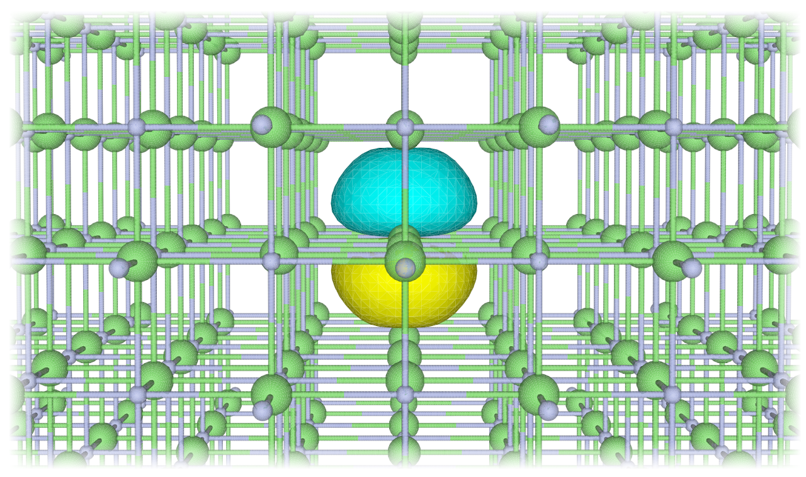

Alexander Rumpf successfully finished his project work *Bonding Orbitals in Solids*.

{fig-align="center" width="50%"}

In this work he focused on two questions: (1) Does the suitability to construct sparse tensors of localised orbitals deteriorate for materials with small band gaps and diffuse density? (2) Are there trends in the orbital spreads or the sparsity concerning the bandgap or lattice constant?
We will be publishing the intriguing results soon.

