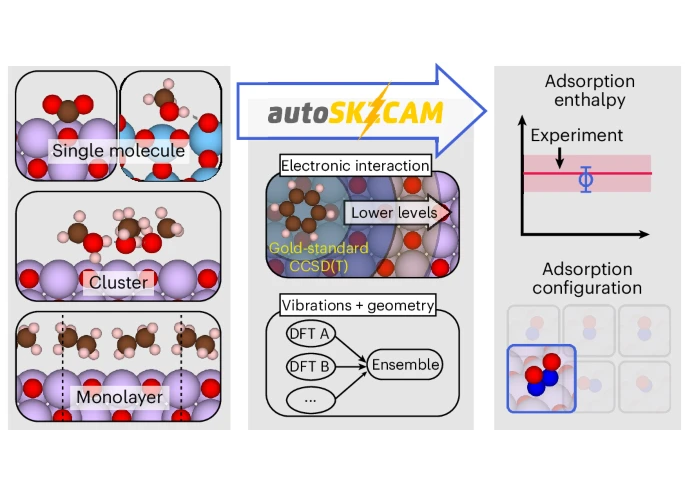

[An accurate and efficient framework for modelling the surface chemistry of ionic materials](https://doi.org/10.1038/s41557-025-01884-y)

{fig-align="center" width="50%"}

Benjamin Shi has developed a new automated and open-source framework (autoSKZCAM) for molecular adsorption on ionic materials by leveraging a multilevel embedding approach. This makes it practical to apply highly accurate correlated wavefunction theory, achieving results comparable to experiments at a manageable computational cost. It was an honor to contribute to this work in a great collaboration with Benjamin X. Shi, Andrea Zen, Angelos Michaelides, and coworkers.