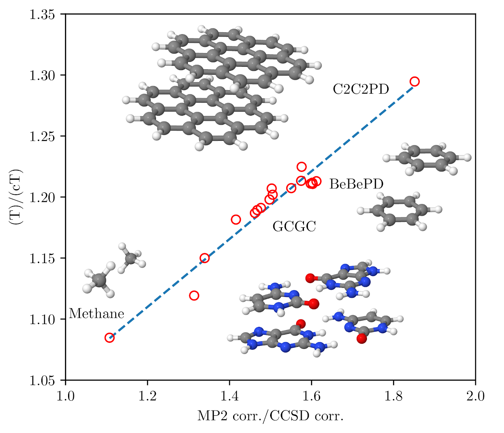

[Understanding Discrepancies of Wavefunction Theories for Large Molecules](https://doi.org/10.48550/arXiv.2407.01442)

{fig-align="center" width="50%"}

This work demonstrates that one of the most widely-used and accurate quantum chemistry approaches – CCSD(T) theory – in certain cases binds noncovalently interacting large molecular complexes too strongly. Our findings show that a simple yet efficient modification denoted as CCSD(cT) remedies these shortcomings.