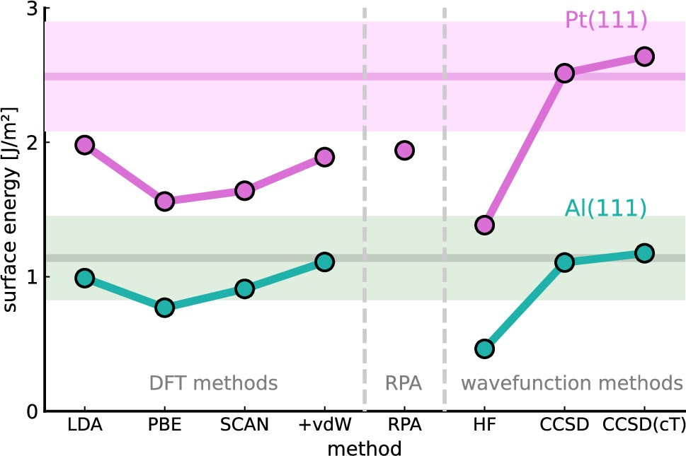

[An accurate and efficient framework for modelling the surface chemistry of ionic materials](https://doi.org/10.1021/acs.jpclett.4c03134)

{fig-align="center" width="50%"}

In this publication we introduce a novel finite-size correction scheme to enable coupled cluster theory for highly accurate materials modeling of metals. Using the example of metal surface energies, which are highly relevant due to their wide range of applications, we demonstrated that this observable can be reliably reproduced with high precision for the first time.