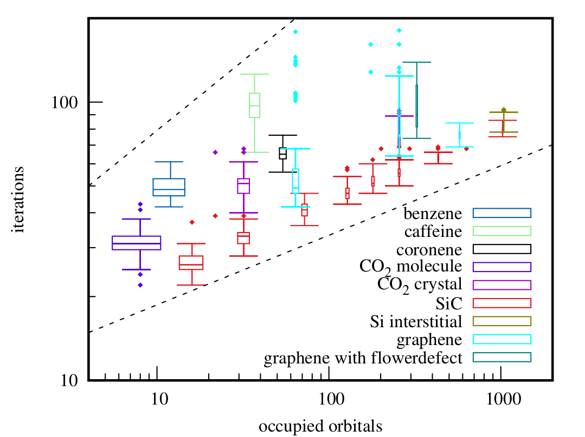

Benjamin Wöckinger successfully passed his Master's exam about orbital localization in solids. 

{fig-align="center" width="50%"}

In his thesis [Orbital Localization in Solids by Riemannian Optimization](https://dx.doi.org/10.34726/hss.2024.124955?locale=en) he implemented and tested different optimization algorithms like BFGS, CG, and SA for orbital localization. Specifically he focused on Intrinsic Bond Orbitals (IBOs). The unitary constraints involved in orbital transformations are inherently satisfied through Riemannian optimization, where cost functions are optimized on Riemannian manifolds. 