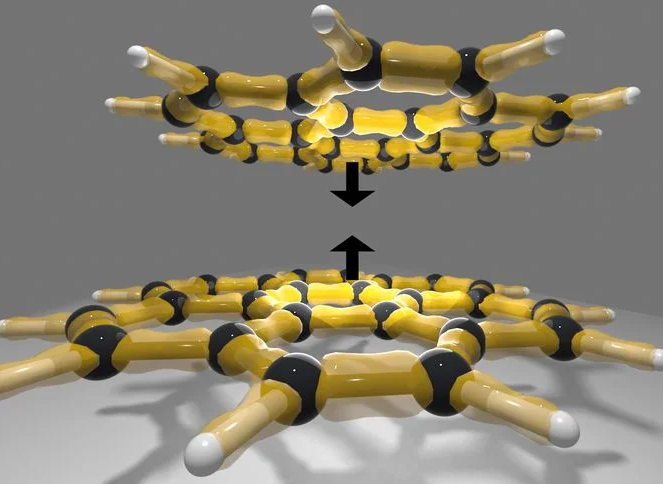

[Understanding discrepancies in noncovalent interaction energies from wavefunction theories for large molecules](https://doi.org/10.1038/s41467-025-64104-8)

{fig-align="center" width="50%"}

Our paper on noncovalent interactions is now published in Nature Communications. We investigate why two of the most trusted methods in quantum chemistry, CCSD(T) and DMC, have shown puzzling disagreements for large molecules. We identify an issue in the standard CCSD(T) method and show how our CCSD(cT) approach fixes this.