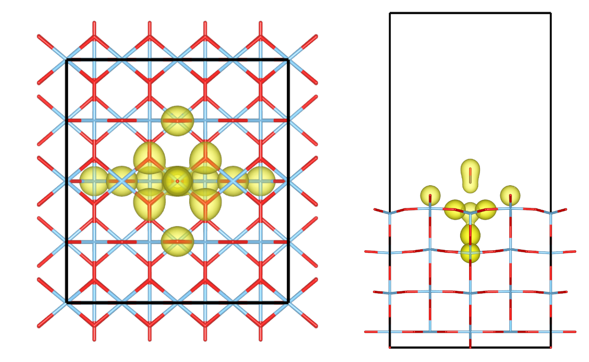

Alexander Rumpf successfully passed his Master's exam about *Fragment-Based Embedding of Correlated Wavefunction
Methods for CO Adsorption on TiO2(110)*. 

{fig-align="center" width="50%"}

In his thesis, he developed enhanced Davidson algorithms to significantly speed up compression techniques of the virtual orbital space starting from the unbiased plane wave basis. This is particularly useful for correlation workflows (e.g., coupled cluster theory) applied to systems which include a lot of vacuum.